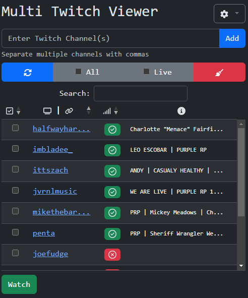

# Multi Twitch Viewer

## Overview

Multi Twitch Viewer is a simple MV3 Chrome extension designed to easily allow keeping track of, creating MultiStre.am links for, and simultaneously watching your favorite Twitch streamers.

This is my first real attempt at making a functioning Chrome extension, so there are sure to be issues.

No affiliation with Twitch or MultiStre.am.

## Running this extension

1. Clone this repository.
2. Load this directory in Chrome as an [unpacked extension](https://developer.chrome.com/docs/extensions/mv3/getstarted/development-basics/#load-unpacked).
3. Pin the extension to the taskbar to access the action button.
4. Open the extension popup by clicking the action button and interact with the UI.

## Permission justifications

- Persistent storage (`storage`): used for saving user-added channels, settings, and preferences.
- Active tab (`activeTab`): used to for QoL features for channels you are watching on the active tab, such as auto-checking watchin channels or auto-adding new watching channels to the add input.
- Site data access to twitch.tv to retrieve channel stream info such as the `isLiveBroadcast` script key and `meta[name=description]` stream title.